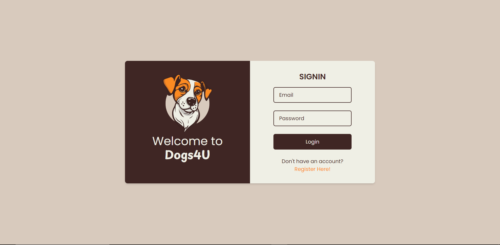

# Dogs4U

Dogs4U is an innovative dashboard that provides a user-friendly platform for dog enthusiasts. Upon registering, users gain access to a vast database of dog images, allowing them to search for specific breeds and sub-breeds. Additionally, users can also enjoy the excitement of discovering random dog images while specifying their preferred breed and sub-breed. Whether you're a dog lover or simply looking for canine inspiration, Dogs4U is the go-to destination for all your dog image needs.
## Screenshots



## Prerequisites

Before you can use this project, make sure you have the following software installed on your system:

- [Node.js](https://nodejs.org/) (version 18.17 or higher)
  - Node.js is a JavaScript runtime that this project relies on. You can download and install it from the official website.

- [MySQL](https://www.mysql.com/)
  - MySQL is the database management system used by this project. Please ensure you have it installed and configured.

- [Visual Studio Code](https://code.visualstudio.com/) (optional but recommended for development)
  - Visual Studio Code is a versatile code editor that is highly recommended for development with this project. It offers useful extensions and tools to streamline your workflow.

Please make sure you have these prerequisites in place before you proceed with using or contributing to this project.

## How to Install

To develop this project i employed React for the frontend and Node.js for the backend, facilitating seamless interaction with APIs and database communication.

To get started with this project, follow these steps to install and set it up on your local machine:

1.  **Clone the Repository**:
   - Open your terminal or command prompt and navigate to the directory where you want to store the project.
   - Run the following command to clone the repository:
  ```
  git clone https://github.com/salvog9/Dogs4U.git
  ```

2.  **Install dependencies**
  - Navigate to the backend directory:

    ```
    cd backend
    ```
  - **Install backend dependencies using npm**:   

    ```
    npm install
    ```
  - Go to the `config` directory within the backend folder and set your local database settings under the "Development" section in the `config.json` file.
  - Migrate the User table to your local database using Sequelize CLI:

    ```
    npx sequelize-cli db:migrate
    ```
  - Start the server:

    ```
    npm start
    ```
  - Navigate to the frontend folder

    ```
    cd frontend
    ```
  - Install frontend dependencies using npm:

    ```
    npm install
    ```
  - Initialize the frontend project for development:

    ```
    npm run dev
    ```
Now you've successfully set up both the backend and frontend of the project. You can access the application at http://localhost:5173 in your web browser.
If you encounter any issues or have further questions, please refer to the project-specific documentation or seek assistance from the project maintainers.

## How to use

Once you have started the local server, as it will be your first time accessing the app, you will need to register through the SignUp page. If the registration is successful, you will be redirected to the Login page. To access the dashboard, you will need to enter the email and password you previously saved. Once inside, on your right, you can choose the image search mode: complete list of images by breed, complete list of images by breed and (where available) sub-breed, random image by breed, and random image by breed and sub-breed.

## Author

@salvog9

## License

MIT


